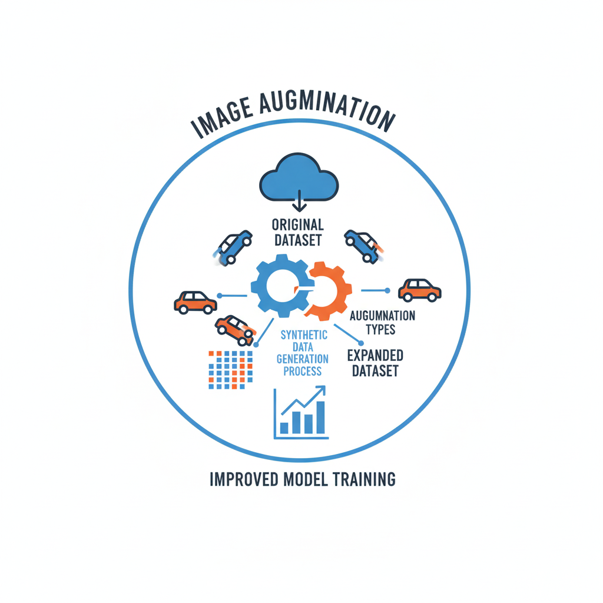

# Road Crack Segmentation: Data Augmentation Visualizations

This repository contains visual comparisons of 24 different data augmentation techniques applied to road crack images for a graduation paper on Mask R-CNN-based segmentation.

## Project Overview

The goal is to systematically analyze how individual data augmentation techniques impact the performance of road crack segmentation. The methodology involves:

1. Training a baseline Mask R-CNN model on original, un-augmented dataset
2. Training multiple "challenger" models, each using baseline data plus one specific augmentation
3. Comparing segmentation mAP of all models on a fixed validation set

## Structure

```
.
├── Visualizations.ipynb        # Jupyter notebook generating all visualizations
├── aug_visual_results/         # Generated comparison images
│   ├── exp01_baseline/         # Baseline (resize only)
│   ├── exp02_hflip/            # Horizontal Flip
│   ├── exp03_vflip/            # Vertical Flip
│   ├── exp04_rotate/           # Rotation
│   ├── exp05_scale/            # Random Scale
│   ├── exp06_affine/           # Affine Transform
│   ├── exp07_randomresizedcrop/# Random Resized Crop
│   ├── exp08_brightnesscontrast/# Brightness & Contrast
│   ├── exp09_hsv/              # HSV Color Space
│   ├── exp10_clahe/            # CLAHE
│   ├── exp11_channelshuffle/   # Channel Shuffle
│   ├── exp12_elastictransform/ # Elastic Transform
│   ├── exp13_griddistortion/   # Grid Distortion
│   ├── exp14_opticaldistortion/# Optical Distortion
│   ├── exp15_piecewiseaffine/  # Piecewise Affine
│   ├── exp16_randomerasing/    # Random Erasing
│   ├── exp17_cutout/           # Cutout
│   ├── exp18_gridmask/         # Grid Mask
│   ├── exp19_gaussnoise/       # Gaussian Noise
│   ├── exp20_motionblur/       # Motion Blur
│   ├── exp21_gaussianblur/     # Gaussian Blur
│   ├── exp22_medianblur/       # Median Blur
│   ├── exp23_mixup/            # MixUp
│   └── exp24_cutmix/           # CutMix
└── README.md                   # This file
```

## Augmentation Techniques

### Geometric Transforms
- **Horizontal Flip** (exp02): Horizontal reflection
- **Vertical Flip** (exp03): Vertical reflection
- **Rotation** (exp04): Random rotation up to 90°
- **Scale** (exp05): Random scaling up to 20%
- **Affine** (exp06): Combined scale, translate, rotate, shear
- **Random Resized Crop** (exp07): Crops and resizes to target dimensions
- **Elastic Transform** (exp12): Local elastic distortions
- **Grid Distortion** (exp13): Grid-based distortions
- **Optical Distortion** (exp14): Simulates lens distortion
- **Piecewise Affine** (exp15): Locally affine transformations

### Photometric Augmentations
- **Brightness & Contrast** (exp08): Random brightness/contrast adjustment
- **HSV** (exp09): Hue, saturation, value adjustments
- **CLAHE** (exp10): Contrast Limited Adaptive Histogram Equalization
- **Channel Shuffle** (exp11): Random channel permutation

### Regularization Techniques
- **Random Erasing** (exp16): Random rectangular regions filled with mean
- **Cutout** (exp17): Multiple random holes removed
- **Grid Mask** (exp18): Grid-based dropout pattern
- **MixUp** (exp23): Linear interpolation between two images
- **CutMix** (exp24): Cut and paste patches between images

### Noise & Blur
- **Gaussian Noise** (exp19): Additive Gaussian noise
- **Motion Blur** (exp20): Linear motion blur
- **Gaussian Blur** (exp21): Gaussian filtering
- **Median Blur** (exp22): Median filtering

## Visualizations

Each experiment folder contains 25 comparison images showing:
- **Top**: Original image (resized to match)
- **Bottom**: Augmented image

Images are named as: `{original_filename}_compare.jpg`

## Usage

1. Install dependencies:
```bash
pip install -r requirements.txt
```

2. Update paths in `Visualizations.ipynb`:
   - Set `image_dir` to your input image directory
   - Set `output_dir` to desired output directory

3. Run all cells in `Visualizations.ipynb`

## Dependencies

- Python 3.x
- OpenCV (cv2)
- NumPy
- Albumentations 1.3.1
- tqdm
- Jupyter

## Notes

- All augmentations replicate the exact pipeline used during training
- MixUp and CutMix require manual implementation (not in Albumentations)
- Images are padded to max dimensions before applying MixUp/CutMix
- All geometric transforms use mean BGR values [123.675, 116.28, 103.53] for filling

